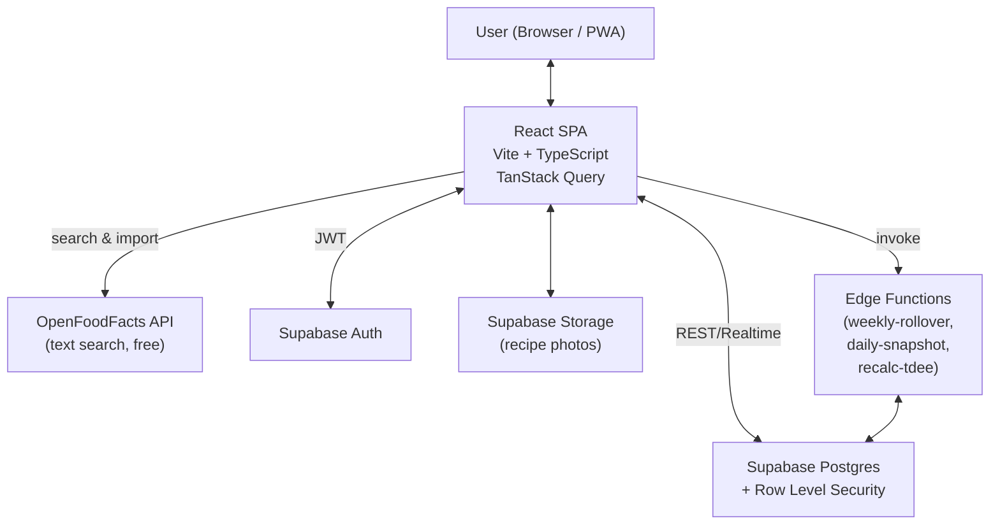

# Hudson's Fitness — Architecture & Database Schema

> MVP technical specification. Bilingual (ES/EN) web app for tracking body composition, macros, recipes, weekly meal plans, and dietary phases. Built on React + Supabase. Designed for a single user initially but multi-tenant from day one, with a **shared ingredient library** that grows as users contribute.

---

## 1. MVP Scope

**In scope (v1):**
- Daily food log (Diario) with meal counters, real-time macros, manual entries
- Recipe library (Recetas) with serving scaling, two-column live macros editor, grid/list view toggle
- **Shared ingredient database** (Ingredientes) — crowdsourced library combining user contributions, OpenFoodFacts imports, and (future) BEDCA seed
- Progress charts (Progreso) — weight, body fat, muscle, water, bone with moving average **+ planned/consumed kcal & macros over time**
- Phase & Goals config — cut/maintenance/bulk with calorie targets, derived macro targets, target weight from body-fat goal
- **Weekly meal planner** — named templates, dynamic active week, multi-recipe slots, mid-week template swap, automatic Monday rollover
- **Daily nutrition history** — daily snapshot of planned vs. consumed kcal & macros
- Bilingual UI (ES/EN) with per-user preference
- Seed data (ingredients + recipes from current Excel, pre-extracted to JSON)

**Out of scope (post-MVP):**
- Barcode scanner / OpenFoodFacts barcode lookup (text search is in v1)
- FatSecret integration (only US data is free; not worth it for Spain)
- Smart scale integrations (Withings, Apple Health, Health Connect)
- Recipe URL import
- Workout module
- Auto-generated shopping lists
- Sleep / mood tracking
- Native mobile apps (PWA covers it for v1)

---

## 2. Tech Stack

| Layer | Choice | Why |
|---|---|---|
| Frontend framework | **React 18 + Vite + TypeScript** | Fast dev loop, type safety, mature ecosystem |
| Styling | **Tailwind CSS + shadcn/ui** | Bold & modern aesthetic, minimal custom CSS |
| Routing | **React Router v6** | Standard SPA routing |
| Data fetching | **TanStack Query (React Query)** | Caching, optimistic updates, background sync |
| Charts | **shadcn/ui Charts** (Recharts-based) | Same design tokens as the rest of the UI; drop to raw Recharts for complex custom visuals |
| Forms | **React Hook Form + Zod** | Validation + type inference |
| i18n | **react-i18next** | De-facto standard, lazy-loaded namespaces |
| Backend / DB | **Supabase (PostgreSQL 15+)** | Auth + Postgres + Storage + Edge Functions in one |
| Auth | **Supabase Auth** | Email/password + Google OAuth |
| External nutrition data | **OpenFoodFacts** (no key, free) | Best European/Spanish coverage; FatSecret discarded (only US data is free) |
| Hosting (frontend) | **Vercel** | Free tier, EU edge, GitHub integration |
| Hosting (backend) | **Supabase EU region (Frankfurt)** | GDPR compliance |
| Date handling | **date-fns** with `es` / `en-GB` locales | Lightweight, locale-aware |

---

## 3. System Architecture



**Data flow:** the React SPA talks to Supabase directly via the auto-generated REST API (PostgREST) and Realtime subscriptions. RLS policies on every table ensure users only see their own data — except for `ingredients`, which is intentionally shared across users (see §4.3 + §5). OpenFoodFacts is queried directly from the browser (CORS-friendly, no key). Edge Functions handle scheduled background tasks.

---

## 4. Database Schema (PostgreSQL / Supabase)

### 4.1 Profile & Settings

```sql
-- Extends Supabase's built-in auth.users table
create table public.profiles (
  id uuid primary key references auth.users(id) on delete cascade,
  display_name text,
  language text not null default 'es' check (language in ('es', 'en')),
  units text not null default 'metric' check (units in ('metric', 'imperial')),
  start_date date not null default current_date,
  initial_weight_kg numeric(5,2),
  sex text check (sex in ('male', 'female', 'other')),
  birth_date date,
  height_cm numeric(5,1),
  created_at timestamptz not null default now(),
  updated_at timestamptz not null default now()
);
```

### 4.2 Body Composition (Métricas)

```sql
create table public.body_measurements (
  id uuid primary key default gen_random_uuid(),
  user_id uuid not null references public.profiles(id) on delete cascade,
  measured_on date not null,
  weight_kg numeric(5,2),
  body_fat_pct numeric(4,2),  -- 0-100
  muscle_pct numeric(4,2),
  water_pct numeric(4,2),
  bone_kg numeric(4,2),       -- absolute bone mass in kg (matches smart-scale convention)
  notes text,
  created_at timestamptz not null default now(),
  unique (user_id, measured_on)  -- one measurement per day
);

create index idx_body_measurements_user_date 
  on public.body_measurements (user_id, measured_on desc);
```

> **Moving average** is computed via a Postgres view — see §6.2.

### 4.3 Ingredients (Shared Library)

The ingredient library is **shared across all users**. When user A imports a product from OpenFoodFacts or creates a manual entry, user B sees it next time they search. This bootstraps a useful database of Spanish foods quickly without requiring a giant pre-seed.

```sql
-- Trigram extension enables fast fuzzy text search
create extension if not exists pg_trgm;

-- Ingredients are SHARED across all users (crowdsourced library).
-- created_by_user_id = null indicates a system-seeded ingredient (future BEDCA dump, etc.)
create table public.ingredients (
  id uuid primary key default gen_random_uuid(),
  created_by_user_id uuid references public.profiles(id) on delete set null,
  name text not null,
  brand text,                                       -- "Hacendado", "Pascual", null for genéricos
  unit_type text not null default 'gram' check (unit_type in ('gram', 'unit')),
  -- Macros per 100g (or per unit if unit_type = 'unit')
  kcal_per_unit numeric(7,2) not null,
  protein_g_per_unit numeric(6,2) not null,
  carbs_g_per_unit numeric(6,2) not null,
  fat_g_per_unit numeric(6,2) not null,
  fiber_g_per_unit numeric(6,2) not null default 0,
  -- Provenance
  source text not null default 'manual'
    check (source in ('manual', 'openfoodfacts', 'bedca', 'system')),
  external_id text,                                 -- OFF barcode, BEDCA ID, etc.
  is_verified boolean not null default false,       -- moderation flag (post-MVP)
  created_at timestamptz not null default now(),
  updated_at timestamptz not null default now(),
  -- Prevents duplicate API imports across all users
  unique (source, external_id),
  -- Consistency: external_id only meaningful for API-sourced rows
  constraint ingredients_external_consistency check (
    external_id is null or source in ('openfoodfacts', 'bedca')
  )
);

-- Trigram indexes for fast fuzzy text search 
-- (matches "yogur" → "yogures", "yogurt", typos, etc.)
create index idx_ingredients_name_trgm 
  on public.ingredients using gin (name gin_trgm_ops);
create index idx_ingredients_brand_trgm 
  on public.ingredients using gin (brand gin_trgm_ops) where brand is not null;
```

**Rules of the road for the shared library** (enforced via RLS, see §5):
- Anyone can read the entire library.
- Anyone can insert new ingredients; the row is tagged with `created_by_user_id`.
- Only the creator can edit or delete their own contributions. System seeds (`created_by_user_id = null`) are immutable.
- Deletion is blocked by FK if any recipe (anyone's) references the ingredient. This is the "you can't pull the rug" rule.
- Duplicate API imports are prevented by `unique (source, external_id)` — if user B tries to import the same OFF barcode user A already imported, the existing row is reused.

### 4.4 Recipes

Recipes are **per-user** (private). They reference the shared ingredient library.

```sql
create table public.recipes (
  id uuid primary key default gen_random_uuid(),
  user_id uuid not null references public.profiles(id) on delete cascade,
  name text not null,
  servings numeric(5,2) not null default 1 check (servings > 0),
  description text,
  instructions text,
  photo_url text,
  created_at timestamptz not null default now(),
  updated_at timestamptz not null default now(),
  unique (user_id, name)
);

create table public.recipe_ingredients (
  id uuid primary key default gen_random_uuid(),
  recipe_id uuid not null references public.recipes(id) on delete cascade,
  -- Points to the shared ingredient library; ON DELETE RESTRICT protects shared data
  ingredient_id uuid not null references public.ingredients(id) on delete restrict,
  quantity numeric(8,2) not null,              -- in grams or units depending on ingredient.unit_type
  -- "per_serving = false" means the quantity scales with servings (default).
  -- "per_serving = true" means the quantity is added per serving served (e.g. rice in curry).
  per_serving boolean not null default false,
  display_order int not null default 0,
  created_at timestamptz not null default now()
);

create index idx_recipe_ingredients_recipe on public.recipe_ingredients (recipe_id);
```

> The `per_serving` flag captures your curry trick: the guiso macros divide by 5 servings, but the rice (70 g) is added fresh each time it's served.

### 4.5 Meal Logging (Diario)

```sql
create table public.meal_logs (
  id uuid primary key default gen_random_uuid(),
  user_id uuid not null references public.profiles(id) on delete cascade,
  logged_on date not null,
  meal_type text check (meal_type in ('breakfast', 'lunch', 'snack', 'dinner', 'other')),
  -- Exactly one of these three sources must be set:
  recipe_id uuid references public.recipes(id) on delete set null,
  ingredient_id uuid references public.ingredients(id) on delete set null,
  -- For ad-hoc entries (the "manual dinner" pattern from your Excel):
  custom_name text,
  -- Quantities (semantics depend on which source is set)
  servings numeric(6,2),                        -- when recipe_id
  quantity numeric(8,2),                        -- when ingredient_id (g or units)
  -- Cached macros for custom entries (denormalized on purpose)
  custom_kcal numeric(7,2),
  custom_protein_g numeric(6,2),
  custom_carbs_g numeric(6,2),
  custom_fat_g numeric(6,2),
  custom_fiber_g numeric(6,2),
  -- Plan integration: marks entries auto-materialized from the active meal plan
  from_plan boolean not null default false,
  plan_week_slot_id uuid references public.meal_plan_week_slots(id) on delete set null,
  notes text,
  created_at timestamptz not null default now(),

  -- Enforce exactly-one-source
  constraint meal_log_one_source check (
    (recipe_id is not null)::int +
    (ingredient_id is not null)::int +
    (custom_name is not null)::int = 1
  )
);

create index idx_meal_logs_user_date on public.meal_logs (user_id, logged_on desc);
```

### 4.6 Goals & Phases (the macro engine)

```sql
-- Long-term goal: target body fat % and derived target weight
create table public.goals (
  user_id uuid primary key references public.profiles(id) on delete cascade,
  target_body_fat_pct numeric(4,2) not null default 20,
  notes text,
  updated_at timestamptz not null default now()
);

-- A phase is a time-boxed dietary period (cut / maintenance / bulk)
create table public.phases (
  id uuid primary key default gen_random_uuid(),
  user_id uuid not null references public.profiles(id) on delete cascade,
  name text not null,                              -- e.g. "Verano 2026 cut"
  phase_type text not null check (phase_type in ('cut', 'maintenance', 'bulk')),
  start_date date not null,
  end_date date,                                   -- null = ongoing/active
  -- Calorie target: either an absolute kcal value or a delta from current TDEE
  kcal_mode text not null check (kcal_mode in ('absolute', 'tdee_delta')),
  kcal_value numeric(6,1) not null,                -- 2200 (absolute) OR -500 (delta)
  -- Macro distribution rules
  protein_g_per_kg numeric(4,2) not null default 1.80,   -- 1.6 lean, 2.0+ aggressive cut
  fat_pct_of_kcal numeric(4,3) not null default 0.250,   -- 25% of kcal from fat
  fiber_mode text not null default 'per_1000_kcal' 
    check (fiber_mode in ('fixed_g', 'per_1000_kcal')),
  fiber_value numeric(5,2) not null default 14,          -- 14g per 1000 kcal, or 25 fixed
  notes text,
  created_at timestamptz not null default now(),
  -- Prevent overlapping active phases for one user
  exclude using gist (
    user_id with =,
    daterange(start_date, coalesce(end_date, 'infinity'::date), '[]') with &&
  )
);

create index idx_phases_user_active 
  on public.phases (user_id, start_date desc) 
  where end_date is null;
```

> The `EXCLUDE` constraint with `daterange` is a Postgres feature that prevents two phases from overlapping for the same user — much cleaner than triggers. Requires the `btree_gist` extension: `create extension if not exists btree_gist;`

### 4.7 Meal Planning (Plantillas + Semana activa)

The planner has two layers. **Templates** are the reusable upstream — named, named multiple, edited freely. **Weeks** are the dynamic working copy generated from a template; once edits diverge, they get auto-snapshotted into a new template at rollover.

```sql
-- ===== Templates (named reusable menus) =====
create table public.meal_plan_templates (
  id uuid primary key default gen_random_uuid(),
  user_id uuid not null references public.profiles(id) on delete cascade,
  name text not null,                                       -- editable; auto-named "Custom — semana del DD MMM YYYY" if generated by rollover
  same_schedule_all_days boolean not null default true,
  default_meal_times time[] not null default array['08:00','13:00','17:00','21:00']::time[],
  is_auto_generated boolean not null default false,         -- true if created from divergent week at rollover
  notes text,
  created_at timestamptz not null default now(),
  updated_at timestamptz not null default now(),
  unique (user_id, name)
);

-- Per-day meal-time overrides (only used when same_schedule_all_days = false,
-- or when a specific day's number of meals/timing differs from the default)
create table public.meal_plan_template_day_times (
  id uuid primary key default gen_random_uuid(),
  template_id uuid not null references public.meal_plan_templates(id) on delete cascade,
  day_of_week int not null check (day_of_week between 0 and 6),  -- 0 = Monday (ISO)
  meal_times time[] not null,                               -- length = #meals that day
  unique (template_id, day_of_week)
);

-- Recipes assigned to each meal slot in a template (multiple recipes per slot allowed)
create table public.meal_plan_template_slots (
  id uuid primary key default gen_random_uuid(),
  template_id uuid not null references public.meal_plan_templates(id) on delete cascade,
  day_of_week int not null check (day_of_week between 0 and 6),
  meal_index int not null check (meal_index >= 0),          -- 0..N-1, position within the day
  recipe_id uuid not null references public.recipes(id) on delete restrict,
  servings numeric(5,2) not null default 1 check (servings > 0),
  display_order int not null default 0,                     -- order within multi-recipe slot
  created_at timestamptz not null default now()
);

create index idx_template_slots 
  on public.meal_plan_template_slots (template_id, day_of_week, meal_index);

-- ===== Active dynamic week =====
create table public.meal_plan_weeks (
  id uuid primary key default gen_random_uuid(),
  user_id uuid not null references public.profiles(id) on delete cascade,
  week_start date not null,                                 -- Monday of the week
  source_template_id uuid references public.meal_plan_templates(id) on delete set null,
  has_diverged boolean not null default false,              -- true if user has edited slots from the template
  created_at timestamptz not null default now(),
  updated_at timestamptz not null default now(),
  unique (user_id, week_start)
);

-- Slots inside the dynamic week (mirror template structure but per-date and editable)
create table public.meal_plan_week_slots (
  id uuid primary key default gen_random_uuid(),
  plan_week_id uuid not null references public.meal_plan_weeks(id) on delete cascade,
  date date not null,
  meal_index int not null check (meal_index >= 0),
  meal_time time,                                           -- resolved at generation time
  recipe_id uuid not null references public.recipes(id) on delete restrict,
  servings numeric(5,2) not null default 1 check (servings > 0),
  display_order int not null default 0,
  created_at timestamptz not null default now()
);

create index idx_plan_week_slots 
  on public.meal_plan_week_slots (plan_week_id, date, meal_index);

-- Trigger: any insert/update/delete on week_slots for a date >= current_date 
-- flips the parent week's has_diverged to true.
create or replace function mark_week_diverged() returns trigger as $$
begin
  update public.meal_plan_weeks
    set has_diverged = true, updated_at = now()
    where id = coalesce(new.plan_week_id, old.plan_week_id)
      and coalesce(new.date, old.date) >= current_date;
  return coalesce(new, old);
end;
$$ language plpgsql;

create trigger trg_mark_week_diverged
  after insert or update or delete on public.meal_plan_week_slots
  for each row execute function mark_week_diverged();
```

### 4.8 Daily Nutrition History (planned vs consumed)

Daily snapshot computed by the `daily-nutrition-snapshot` Edge Function. Drives the long-term diet history charts on the Progreso page (parallel to weight/body-fat history).

```sql
create table public.daily_nutrition_history (
  user_id uuid not null references public.profiles(id) on delete cascade,
  logged_on date not null,
  -- Planned (sum of meal_plan_week_slots × recipe macros for that day)
  planned_kcal numeric(7,1),
  planned_protein_g numeric(6,2),
  planned_carbs_g numeric(6,2),
  planned_fat_g numeric(6,2),
  planned_fiber_g numeric(6,2),
  -- Consumed (sum of meal_logs aggregated for that day)
  consumed_kcal numeric(7,1),
  consumed_protein_g numeric(6,2),
  consumed_carbs_g numeric(6,2),
  consumed_fat_g numeric(6,2),
  consumed_fiber_g numeric(6,2),
  had_active_plan boolean not null default false,
  computed_at timestamptz not null default now(),
  primary key (user_id, logged_on)
);

create index idx_daily_history_user 
  on public.daily_nutrition_history (user_id, logged_on desc);
```

### 4.9 Adaptive TDEE Cache

```sql
-- Recomputed weekly via Edge Function (cron). Stores the latest estimate.
create table public.tdee_estimates (
  id uuid primary key default gen_random_uuid(),
  user_id uuid not null references public.profiles(id) on delete cascade,
  computed_on date not null,
  window_days int not null,                        -- e.g. 21
  avg_kcal_intake numeric(7,1) not null,
  weight_delta_kg numeric(5,2) not null,
  estimated_tdee_kcal numeric(7,1) not null,       -- empirical total
  bmr_kcal numeric(7,1),                           -- Mifflin-St Jeor
  activity_kcal numeric(7,1),                      -- TDEE − BMR
  workout_kcal_logged numeric(7,1),                -- v1.4+ (sum of logged sessions)
  neat_residual_kcal numeric(7,1),                 -- v1.4+ (activity − workout_logged)
  created_at timestamptz not null default now()
);

create index idx_tdee_user_date on public.tdee_estimates (user_id, computed_on desc);
```

---

## 5. Row Level Security (RLS)

### 5.1 Standard pattern (per-user data)

Most tables hold data that belongs strictly to one user. They follow this pattern:

```sql
alter table public.body_measurements enable row level security;

create policy "Users see own measurements"
  on public.body_measurements for select
  using (auth.uid() = user_id);

create policy "Users insert own measurements"
  on public.body_measurements for insert
  with check (auth.uid() = user_id);

create policy "Users update own measurements"
  on public.body_measurements for update
  using (auth.uid() = user_id);

create policy "Users delete own measurements"
  on public.body_measurements for delete
  using (auth.uid() = user_id);
```

The same four policies are applied to: `profiles`, `recipes`, `recipe_ingredients` (via join to recipes), `meal_logs`, `goals`, `phases`, `meal_plan_templates`, `meal_plan_template_day_times`, `meal_plan_template_slots` (via join to templates), `meal_plan_weeks`, `meal_plan_week_slots` (via join to weeks), `daily_nutrition_history`, `tdee_estimates`.

### 5.2 Special case: `ingredients` (shared library)

Ingredients are intentionally shared, so they need different policies:

```sql
alter table public.ingredients enable row level security;

-- READ: any authenticated user reads the entire shared library
create policy "All users read ingredients"
  on public.ingredients for select
  to authenticated
  using (true);

-- INSERT: any authenticated user, must mark themselves as creator
create policy "Users insert ingredients"
  on public.ingredients for insert
  to authenticated
  with check (auth.uid() = created_by_user_id);

-- UPDATE: only the creator can edit their own contributions.
-- System seeds (created_by_user_id IS NULL) are effectively immutable.
create policy "Creator updates own ingredients"
  on public.ingredients for update
  to authenticated
  using (auth.uid() = created_by_user_id)
  with check (auth.uid() = created_by_user_id);

-- DELETE: only the creator may delete their own contributions.
-- The FK from recipe_ingredients with ON DELETE RESTRICT additionally blocks
-- deletion if ANY user's recipe references the ingredient.
create policy "Creator deletes own ingredients"
  on public.ingredients for delete
  to authenticated
  using (auth.uid() = created_by_user_id);
```

---

## 6. Computed Logic

### 6.1 Dynamic macro targets (the heart of the app)

Given:
- Active phase for today's date
- Latest weight (from `body_measurements`)
- Latest adaptive TDEE estimate (or fallback to Mifflin-St Jeor)

```typescript
function computeDailyMacroTargets(opts: {
  weightKg: number;
  phase: Phase;
  estimatedTDEE: number;
}): MacroTargets {
  const { weightKg, phase, estimatedTDEE } = opts;

  // 1. Calories
  const kcal = phase.kcal_mode === 'absolute'
    ? phase.kcal_value
    : estimatedTDEE + phase.kcal_value;  // delta is signed (-500 for cut)

  // 2. Protein (g) — driven by current lean mass (weight × (1 − body_fat_pct)).
  //    Falls back to current bodyweight when body_fat_pct is missing.
  //    The phase form is labelled "g/kg lean mass" to make this explicit.
  const proteinG = weightKg * phase.protein_g_per_kg;
  const proteinKcal = proteinG * 4;

  // 3. Fat (g) — % of total kcal
  const fatKcal = kcal * phase.fat_pct_of_kcal;
  const fatG = fatKcal / 9;

  // 4. Carbs (g) — whatever is left
  const carbsKcal = kcal - proteinKcal - fatKcal;
  const carbsG = Math.max(0, carbsKcal / 4);

  // 5. Fiber (g)
  const fiberG = phase.fiber_mode === 'fixed_g'
    ? phase.fiber_value
    : (kcal / 1000) * phase.fiber_value;

  return { kcal, proteinG, carbsG, fatG, fiberG };
}
```

Recomputed reactively whenever weight, phase, or TDEE changes.

### 6.2 Moving average for weight (Postgres view)

```sql
create or replace view public.body_measurements_smoothed as
select
  bm.*,
  avg(bm.weight_kg) over (
    partition by bm.user_id
    order by bm.measured_on
    rows between 4 preceding and current row
  ) as weight_kg_5day_avg
from public.body_measurements bm;
```

### 6.3 Target weight calculation

```typescript
// peso libre de grasa / (1 - % grasa objetivo)
const leanMassKg = currentWeightKg * (1 - currentBodyFatPct / 100);
const targetWeightKg = leanMassKg / (1 - targetBodyFatPct / 100);
```

### 6.4 Adaptive TDEE & energy breakdown (Edge Function, runs weekly)

Energy balance gives us **total** TDEE only — the equation can't separate basal from exercise. To get a useful breakdown, we combine the empirical TDEE with a calculated BMR.

**Step 1 — total TDEE from energy balance:**
```
TDEE = avg(daily_kcal_intake over last N days)
     - (weight_delta_kg × 7700 / N)
```
where 7700 kcal ≈ 1 kg of body weight (approximation; works fine in aggregate). Default window = 21 days, requires at least 14 days of food logs and 5 weight entries.

**Step 2 — BMR via Mifflin-St Jeor** (most accurate non-clinical formula):
```typescript
// Male:   BMR = 10·W + 6.25·H − 5·age + 5
// Female: BMR = 10·W + 6.25·H − 5·age − 161
function mifflinStJeor({ weightKg, heightCm, ageYears, sex }) {
  const base = 10 * weightKg + 6.25 * heightCm - 5 * ageYears;
  return sex === 'male' ? base + 5 : base - 161;
}
```

**Step 3 — derive the activity bucket:**
```
activity_kcal = TDEE − BMR
```
This represents everything beyond resting metabolism: NEAT (steps, fidgeting), workouts, and the thermic effect of food.

**Step 4 (post v1.4, once Workouts module exists)** — further split activity into logged exercise vs. NEAT residual:
```
workout_kcal_logged = sum(workout_session.estimated_kcal over window)   -- from MET × duration × weight
neat_residual       = activity_kcal − workout_kcal_logged
```
This finally gives the user a real "calories burned in training this week" number, separate from background activity.

### 6.5 Bone weight estimation (default for new measurements)

Bone weight isn't measured by most home scales, so we auto-fill it on the new-measurement form using the **BodySpec formula** (±15% accuracy, population average):

```typescript
function estimateBoneKg(opts: {
  heightCm: number;
  weightKg: number;
  ageYears: number;
  sex: 'male' | 'female' | 'other';
}): number {
  const base = -0.25
    + 0.046 * opts.heightCm
    + 0.036 * opts.weightKg
    - 0.012 * opts.ageYears;
  // Optional ±5% sex correction (male skeletons average ~10% heavier than female)
  const sexFactor = opts.sex === 'male' ? 1.05
                  : opts.sex === 'female' ? 0.95
                  : 1.00;
  return Math.round(base * sexFactor * 100) / 100;
}
```

Inputs come from `profiles.height_cm`, `profiles.birth_date` (→ age), `profiles.sex`, and the current measurement's `weight_kg`. The result pre-fills the `bone_kg` field but is **fully editable** — if the user has a smart scale or DEXA reading, they overwrite it. If profile data is missing (height/sex/birth_date null), we leave the field blank rather than guess.

### 6.6 Meal plan: generation, divergence, rollover & sync to Diario

Three flows govern the relationship between **templates** (upstream) and **active week** (working copy):

#### A) Apply a template to the current week (manual or mid-week change)

```
Inputs: user_id, template_id, today
1. week_start = Monday of week containing today
2. UPSERT meal_plan_weeks(user_id, week_start)
   set source_template_id = template_id, has_diverged = false
3. DELETE from meal_plan_week_slots where plan_week_id = ... AND date >= today
4. For each date D from today to (week_start + 6 days):
     day_of_week = ISO weekday of D (0..6)
     meal_times = template_day_times[day_of_week]?.meal_times
                  ?? template.default_meal_times
     For each meal_index m in (0 .. len(meal_times)-1):
       For each template_slot where day_of_week = day_of_week and meal_index = m:
         INSERT meal_plan_week_slots(plan_week_id, date=D, meal_index=m,
                                     meal_time=meal_times[m],
                                     recipe_id, servings, display_order)
5. Days < today are NOT touched (preserves history on mid-week switches)
```

#### B) User edits the active week

Frontend mutates `meal_plan_week_slots` directly (insert / update / delete). The trigger `trg_mark_week_diverged` flips `meal_plan_weeks.has_diverged = true` whenever a slot at `date >= today` changes.

The user can also manually click **"Save as template"** at any time → snapshot current week's slots into a new `meal_plan_templates` row (with auto-generated name they can edit).

#### C) Weekly rollover (`weekly-rollover` Edge Function, every Monday 03:00 CET)

```
For each user with a meal_plan_weeks row for last_week (Mon..Sun just ended):
  template_for_new_week = ?

  IF last_week.has_diverged = false:
    template_for_new_week = last_week.source_template_id
  ELSE:
    -- Snapshot the divergent week as a new auto-generated template
    INSERT meal_plan_templates (
      user_id, name = "Custom — semana del DD MMM YYYY"  (formatted week_start),
      same_schedule_all_days = (heuristic: all days have same meal_times array),
      default_meal_times = most-common meal_times across the week,
      is_auto_generated = true
    ) RETURNING id INTO T_new
    -- Copy slots
    INSERT meal_plan_template_slots from last_week's slots,
      mapping each date to its day_of_week
    -- Per-day overrides where meal_times differ from default
    INSERT meal_plan_template_day_times for divergent days
    template_for_new_week = T_new

  -- Generate the new active week from that template
  Apply flow (A) with template_id = template_for_new_week, today = this Monday
```

#### D) Diario materialization (auto-fill consumed from plan, no confirmation)

When the user opens the Diario for a date `D` (today or any past date) and **no `meal_logs` with `from_plan = true` exist yet** for that user/date:

```
For each meal_plan_week_slot S where S.date = D and S belongs to this user:
  INSERT meal_logs (
    user_id, logged_on = D,
    recipe_id = S.recipe_id,
    servings  = S.servings,
    from_plan = true,
    plan_week_slot_id = S.id
  )
```

The user can edit servings, change the recipe, or delete the entry — `from_plan` stays as a marker of origin. Manual additions remain `from_plan = false`. Plan edits made *after* materialization do NOT propagate back into already-consumed `meal_logs` (intentional: the diary is the truth of "what I ate").

#### E) Daily nutrition snapshot (`daily-nutrition-snapshot` Edge Function, 02:00 CET daily, for previous day)

```
For yesterday's date D, for each user:
  plan_week  = meal_plan_weeks containing D for this user
  had_plan   = plan_week is not null
  planned_*  = sum over (meal_plan_week_slots × recipes computed macros) where date = D
  consumed_* = sum over (meal_logs aggregated to macros) where logged_on = D
  UPSERT daily_nutrition_history (user_id, logged_on = D, ...)
```

Drives the long-term diet history charts on `/progreso`.

### 6.7 Ingredient search & OpenFoodFacts import flow

Search box on the Ingredientes page and inside the recipe editor:

```typescript
async function searchIngredients(query: string) {
  // 1. Hit local shared library first (fast, no rate limits)
  const { data: local } = await supabase
    .from('ingredients')
    .select('*')
    .or(`name.ilike.%${query}%,brand.ilike.%${query}%`)
    .order('is_verified', { ascending: false })  // verified first
    .limit(15);

  // 2. If thin results AND query >= 3 chars, also probe OpenFoodFacts
  let externalResults = [];
  if (local.length < 5 && query.length >= 3) {
    const off = await fetch(
      `https://world.openfoodfacts.org/cgi/search.pl?` +
      `search_terms=${encodeURIComponent(query)}&search_simple=1` +
      `&json=1&page_size=10&fields=code,product_name,brands,nutriments,image_thumb_url`
    );
    externalResults = (await off.json()).products
      .filter(p => p.nutriments?.['energy-kcal_100g'])  // skip incomplete
      .map(p => ({ ...p, source: 'openfoodfacts' }));
  }
  
  return { local, external: externalResults };
}
```

When the user picks an OFF result, it's inserted into the shared library:

```typescript
async function importFromOFF(product, userId) {
  const { data, error } = await supabase
    .from('ingredients')
    .insert({
      created_by_user_id: userId,
      name: product.product_name,
      brand: product.brands?.split(',')[0]?.trim() || null,
      kcal_per_unit: product.nutriments['energy-kcal_100g'],
      protein_g_per_unit: product.nutriments.proteins_100g ?? 0,
      carbs_g_per_unit: product.nutriments.carbohydrates_100g ?? 0,
      fat_g_per_unit: product.nutriments.fat_100g ?? 0,
      fiber_g_per_unit: product.nutriments.fiber_100g ?? 0,
      source: 'openfoodfacts',
      external_id: product.code,
    })
    .select('id')
    .single();
  
  // If 23505 (unique violation), the ingredient already existed — fetch and reuse
  if (error?.code === '23505') {
    const { data: existing } = await supabase
      .from('ingredients')
      .select('id')
      .eq('source', 'openfoodfacts')
      .eq('external_id', product.code)
      .single();
    return existing.id;
  }
  return data.id;
}
```

The dedup is enforced by the `unique (source, external_id)` constraint — race-safe even with concurrent users importing the same barcode.

---

## 7. Frontend Architecture

### 7.1 Folder structure

```
src/
├── app/
│   ├── App.tsx
│   ├── router.tsx
│   └── providers.tsx          # QueryClient, i18n, Auth, Theme
├── pages/
│   ├── DiarioPage.tsx
│   ├── PlanificadorPage.tsx
│   ├── PlantillasPage.tsx
│   ├── PlantillaEditorPage.tsx
│   ├── RecetasPage.tsx
│   ├── RecetaEditorPage.tsx
│   ├── IngredientesPage.tsx
│   ├── ProgresoPage.tsx
│   ├── ObjetivosPage.tsx
│   └── SettingsPage.tsx
├── features/
│   ├── meals/
│   │   ├── components/
│   │   ├── hooks/             # useMealLogs, useDailyMacros, useMaterializePlan
│   │   └── api.ts
│   ├── planner/
│   │   ├── components/        # WeeklyGrid, MealSlotEditor, RecipeAutocomplete
│   │   ├── hooks/             # useActiveWeek, useTemplates, useApplyTemplate
│   │   └── api.ts
│   ├── recipes/
│   │   ├── components/        # RecipeCard, RecipeRow, RecipeEditor, IngredientRow, LiveMacrosPanel
│   │   ├── hooks/             # useRecipes, useRecipeMacros
│   │   └── api.ts
│   ├── ingredients/
│   │   ├── components/        # IngredientSearch, CreateIngredientModal, OFFSearchTab, ManualEntryTab
│   │   ├── hooks/             # useIngredientSearch, useImportFromOFF
│   │   └── api.ts
│   ├── body/
│   └── phases/
├── lib/
│   ├── supabase.ts
│   ├── macros.ts              # computeDailyMacroTargets, etc.
│   ├── tdee.ts
│   ├── planner.ts             # template diff, slot helpers
│   ├── openfoodfacts.ts       # search & import helpers
│   └── dates.ts
├── components/
│   ├── ui/                    # shadcn primitives
│   ├── charts/
│   └── layout/
├── i18n/
│   ├── index.ts
│   ├── es.json
│   └── en.json
└── types/
    └── database.ts            # generated from Supabase CLI
```

### 7.2 Routing

```
/                    → redirect to /diario (if authed) or /login
/login
/signup
/diario              → today's log + macros dashboard (with planned vs consumed if plan active)
/diario/:date        → past day view
/planificador        → current week's active plan (edit slots, swap template, "Save as template")
/menus               → list of saved templates
/menus/nuevo         → create new template
/menus/:id           → edit template
/recetas             → recipe library (grid/list toggle)
/recetas/nuevo       → create recipe
/recetas/:id         → edit recipe
/ingredientes        → shared ingredient library (search, view, edit own)
/progreso            → body composition charts + planned/consumed kcal & macros over time
/objetivos           → goal + active phase + macro preview
/settings
```

### 7.3 State management

- **Server state** → TanStack Query (talks to Supabase via PostgREST)
- **Auth state** → Supabase Auth listener exposed via React Context
- **UI state** → local component state + URL params for shareable views
- **No Redux/Zustand needed** for v1

### 7.4 Key MVP screens (UX notes)

- **Diario** — header shows the day's macros: if plan was active, show two stacked progress bars per macro (Plan vs. Consumido). Below, a vertical list of meals (auto-filled + manual) with edit/delete inline.
- **Planificador** — 7-day grid (Mon..Sun). Each day shows meal slots with their times. Each slot lists 1..N recipes; "+" to add another recipe to the slot. Top bar: dropdown to swap the source template, button "Guardar como plantilla", button "Editar horarios" (toggles `same_schedule_all_days` and exposes per-day time editors).
- **Plantillas** — list of templates with last-used date and an `is_auto_generated` badge. Click to edit. The editor mirrors the Planificador grid but operates on the template (no specific dates, just `day_of_week`).
- **Recetas (list)** — grid/list toggle (icon button top-right, persisted to `localStorage`). **Grid view**: cards with photo (or initials placeholder), name, kcal/serving, ingredient count badge. **List view**: dense rows with the same fields. Search bar, "+ Nueva receta" button.
- **Receta Editor** (`/recetas/nuevo` and `/recetas/:id`) — two-column layout on desktop, stacked on mobile:
  - **Left column**: name, servings input, optional photo + instructions, then the ingredient list. Each row has an autocomplete (with sticky "+ Crear nuevo" item that opens the ingredient modal), quantity input with `g` or `unidad` suffix, a "por ración" toggle (`per_serving`), and a delete button. "+ Añadir ingrediente" appends a new row.
  - **Right column (sticky)**: live macros panel. **If `servings === 1`, shows a single column "Macros"**. Otherwise shows two columns — "Totales" and "Por ración". Updates in real time as quantities change. Respects the `per_serving` flag in totals math.
  - **Footer**: Guardar / Cancelar / (Duplicar in edit mode).
  - **Persistence**: single transaction — UPSERT recipes + DELETE+INSERT recipe_ingredients atomically.
- **Ingredientes** — search bar that hits both the shared local library and (when results are thin) OpenFoodFacts in parallel. Results show name + brand + kcal/100g + source badge (📚 local, 🌐 OFF). Ingredients owned by the current user have edit/delete affordances; others (including system seeds) are read-only with a "view details" affordance.
- **Create Ingredient Modal** — reusable modal opened from `/ingredientes` ("+ Nuevo") and from inside the recipe editor's autocomplete (sticky "+ Crear nuevo" item). Three tabs:
  1. **Buscar (OpenFoodFacts)** — debounced search (300 ms), grid of results with thumbnail, brand, name, kcal/100g. Picking one fills the macro fields below; user can adjust before saving.
  2. **Manual** — empty form for typed-in macros.
  3. **Importado** (greyed out, "próximamente" tooltip) — placeholder for v1.1 barcode scanner.
  
  On Guardar: INSERT into shared `ingredients`, then return the new `ingredient_id` to whatever opened the modal (recipe editor row auto-fills).
- **Progreso** — three chart blocks: (1) weight trend with 5-day moving average, (2) body fat / muscle / water / bone over time, (3) **kcal & macros over time** with two lines per metric (planned vs. consumed) sourced from `daily_nutrition_history`.

---

## 8. Internationalization (ES / EN)

`react-i18next` with two namespaces: `common` (UI chrome) and per-feature namespaces lazy-loaded as needed.

```
src/i18n/
├── es/
│   ├── common.json
│   ├── diario.json
│   ├── planner.json
│   ├── recetas.json
│   ├── ingredientes.json
│   └── progreso.json
└── en/
    ├── common.json
    ├── diario.json
    ├── planner.json
    ├── recetas.json
    ├── ingredientes.json
    └── progreso.json
```

**Detection order:** `profile.language` (if logged in) → `localStorage` → browser `navigator.language` → fallback to `es`.

**Locale-aware formatting:** dates via `date-fns` with `es` / `en-GB` locales, numbers via `Intl.NumberFormat` (decimal commas in Spanish, periods in English).

**Stored content** (recipe names, ingredient names, brands, template names) is **not** auto-translated — it's whatever the user typed. This keeps the model simple.

---

## 9. Authentication & Privacy (GDPR)

- Supabase Auth with email/password + Google OAuth
- Region: **Supabase EU (Frankfurt)** — keeps personal data in the EU
- Right to export: a "Download all my data" button hits an Edge Function that returns a ZIP with JSON exports of every table for the user
- Right to deletion: account deletion cascades via `on delete cascade` on most FKs to `profiles.id`, **with one intentional exception**: `ingredients.created_by_user_id` uses `on delete set null` so a user's contributions to the shared ingredient library survive their account deletion (anonymized — `created_by_user_id` becomes null and the row functions like a system seed thereafter)
- No analytics tracking by default; if added later, use a self-hostable EU option (Plausible, Umami)
- Privacy policy + cookie banner required before launch

---

## 10. Edge Functions

| Function | Trigger | Purpose |
|---|---|---|
| `weekly-rollover` | Cron (Mondays 03:00 CET) | For each user, generate the new active week from the previous week's source template; if previous week was diverged, snapshot it as an auto-generated template first. Doubles as the project keep-alive ping (see §11) |
| `recalculate-tdee` | Cron (Mondays 03:00 CET, after rollover) | For each user with enough data, compute and store new `tdee_estimates` row (TDEE + BMR + activity breakdown) |
| `daily-nutrition-snapshot` | Cron (daily 02:00 CET) | For yesterday's date, compute and upsert `daily_nutrition_history` (planned + consumed kcal & macros) for each active user |
| `daily-summary` | Cron (daily, optional) | Future: send "you have X kcal left" push notifications |

Edge Functions run on Deno, have automatic JWT verification, and respect RLS when using the user's auth token. For cron-triggered functions that need to act on multiple users, they use the service role key and explicitly scope queries by `user_id`.

---

## 11. Data Seeding & Operational Notes

### 11.1 Initial data seeding (instead of Excel import)

Rather than building a full XLSX parser, we'll **pre-extract** the useful content from `GYM Gonzalo.xlsx` once (using AI / manual cleanup) into clean JSON or SQL seed files committed to the repo:

```
/supabase/seed/
├── ingredients.json   # ~21 ingredients with macros per 100g/unit (created_by_user_id = null → system seeds)
├── recipes.json       # ~10 recipes belonging to the founding user
└── seed.sql           # generated INSERTs for first DB bootstrap
```

The seed runs once on initial setup (`supabase db reset` or a one-shot script). Ingredients are inserted as **system seeds** (`created_by_user_id = null`, `source = 'system'`), making them immediately available to all future users via the shared library.

**Future expansion (post-MVP):** a BEDCA seed of ~100 generic Spanish foods (huevos, pollo, arroz blanco, leche entera, aceite de oliva, etc.) extracted from the official BEDCA database. This significantly improves the autocomplete experience for genéricos that OpenFoodFacts doesn't cover well. Implemented as a one-time migration script that idempotently inserts new system rows.

### 11.2 Free-tier keep-alive

Supabase free-tier projects **auto-pause after 7 days of no activity**. The project resumes in ~30 seconds when first hit, but it's a cold-start UX problem.

**Solution:** the weekly `weekly-rollover` cron (Monday 03:00 CET) and the daily `daily-nutrition-snapshot` cron both read and write the database, which counts as activity and resets the 7-day counter. No extra service needed — it's a free side-effect of work we'd be doing anyway.

If those crons are ever removed or paused, set up a fallback:
- A GitHub Action running `curl https://<project>.supabase.co/rest/v1/profiles?limit=1` every 3–4 days, or
- A Cloudflare Worker scheduled trigger doing the same

### 11.3 Backups (free-tier reality)

The free tier has **no automatic backups**. For a personal project this is acceptable, but worth a weekly safety net:

```bash
supabase db dump --db-url "postgresql://..." > backup-$(date +%F).sql
```

Wire this into the same GitHub Action that does the keep-alive ping — commit the dump to a private repo. Crude but effective until upgrading to Pro (which includes 7-day PITR).

---

## 12. Roadmap (Post-MVP)

| Phase | Features |
|---|---|
| **v1.1** | Barcode scanner (OpenFoodFacts API), Withings OAuth integration, recipe photos, **BEDCA seed** of ~100 generic Spanish foods |
| **v1.2** | **Body-fat goal visual reference** — on the Objetivos page, show reference photos of male/female bodies at different body-fat percentages (e.g. 8/12/15/20/25/30%) so the user can set realistic expectations. Pair with educational copy explaining the **healthy / sustainable / athletic / minimum** ranges per sex (e.g. men: 10–20% healthy, ~6% essential floor; women: 18–28% healthy, ~12% essential floor). Sources cited (ACE, ACSM) |
| **v1.3** | Auto-generated shopping list from active week's plan |
| **v1.4** | Workout module (rutinas, ejercicios, series, RPE, 1RM) using wger API for the exercise library |
| **v1.5** | Apple Health / Health Connect bridge via Capacitor companion apps |
| **v1.6** | Recipe URL importer (JSON-LD parser + LLM ingredient mapping) |
| **v1.7** | Ingredient moderation tooling — flagging, merging duplicates, verification badges, admin dashboard |
| **v2.0** | Native mobile via Capacitor, push notifications, share sheet integration |

---

## 13. Open Questions

Things to confirm before starting v1 implementation:

1. **Default protein target** — `1.6 g/kg` (lean & sustainable) or `2.0 g/kg` (aggressive cut)? Configurable per phase, but what's the default?
2. **Phase overlap** — should past phases be editable, or frozen once their `end_date` passes?
3. **Recipe deletion** — if a recipe has historical meal logs, hard-delete or soft-delete? (Currently `on delete set null` on `meal_logs.recipe_id` so logs survive but lose their link.) Note: recipes referenced by `meal_plan_template_slots` and `meal_plan_week_slots` use `on delete restrict` to prevent breaking the planner — so deletion would require detaching the recipe from all plans first.
4. **Ingredient duplicates** — when two users add the same product with slightly different macros (different label versions, rounding, language), do we let both coexist (current MVP behavior, distinguished by brand and contributor), or do we attempt automatic deduplication? Suggested approach: tolerate duplicates in MVP, address with the v1.7 moderation tooling (manual merge + verification badges).
5. **Photo storage** — Supabase Storage bucket for recipe photos in v1, or postpone to v1.1?
6. **Diet/training reset feature** — TODO: design a "Start fresh" button in Settings that resets the active phase, active meal plan, and (future) workout state without deleting historical data (`body_measurements`, `meal_logs`, `daily_nutrition_history`, `tdee_estimates` all preserved). Useful when returning to the app after a long break. **To be explored in detail in a follow-up conversation.**

---

_Last updated: 2026-05-07 — MVP spec draft 1_
